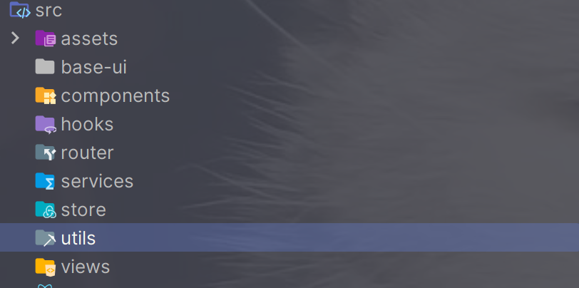

# 初始化React项目
create-react-app <Project> --template typescript
## 别名配置
### 配置项目icon
### 配置项目标题
### 配置项目别名
1. 在craco.config.js中进行配置
```jsx
const path = require('path')
const resolve = (dir)=>path.resolve(__dirname,dir)

module.exports = {
    webpack:{
        alias:{
            '@/*':resolve('src')
        }
    }
}
```
一般webpack的配置是不会显示的，可以通过两种方式进行配置
1. eject将webpack的配置暴露出来（一般不推荐这种方式）
2. craco可以对webpack进行配置
## 配置tsconfig.json
`别名的配置`
```json
{
  "compilerOptions": {
    "target": "es5",
    "lib": [
      "dom",
      "dom.iterable",
      "esnext"
    ],
    "allowJs": true,
    "skipLibCheck": true,
    "esModuleInterop": true,
    "allowSyntheticDefaultImports": true,
    "strict": true,
    "forceConsistentCasingInFileNames": true,
    "noFallthroughCasesInSwitch": true,
    "module": "esnext",
    "moduleResolution": "node",
    "resolveJsonModule": true,
    "isolatedModules": true,
    "noEmit": true,
    "jsx": "react-jsx",
    "baseUrl": ".",
    "paths": {
      "@/*": ["./src/*"]
    }
  },
  "include": [
    "src"
  ]
}

```
## 代码统一规范
eslint + prettier

配置prettier
1. 安装prettier:`npm i prettier -D`
2. 配置.prettierrc文件，配置相关的一些属性
3. 配置.prettierignore来忽略某些文件对应的进行prettierc的规范
4. 添加脚本命令:`"prettier": "prettier --write ."`
配置eslint
1. 安装eslint:`npm i eslint -D`
2. 初始化eslint:`npx eslint --init`

## 目录结构

## 样式重置
1. normalize.css
2. reset.css(自己配置)
配置scss
1.
`yarn add @craco/craco sass sass-loader`
`npm install craco-css-modules`
2.   
```js
const path = require("path");
const resolve = (dir) => path.resolve(__dirname, dir);
const CracoCSSModules = require("craco-css-modules");

module.exports = {
plugins: [{ plugin: CracoCSSModules }],
};
```
## 配置路由
1. `pnpm i react-router-dom`
2. 
```tsx
//router/ranking.tsx
import { RouteObject } from 'react-router-dom'
import React from 'react'

const Discover = React.lazy(() => import('@/views/discover/ranking'))

const routes: RouteObject[] = [
  {
    path: '/discover',
    element: <Discover />
  }
]

export default routes


```
Partial
## 状态管理
@reduxjs/toolkit的工具，更加方便使用redux
1. 安装：`pnpm i @reduxjs/toolkit react-redux`

2. 在store里面创建仓库:store
```jsx
import { configureStore } from '@reduxjs/toolkit'
const store = configureStore({
  reducer: {}
})
export default store

```
3. 引入仓库
```jsx
// 在index.js中的文件
  <Provider store={store}>
  <HashRouter>
    <App />
  </HashRouter>
</Provider>
```
4. 创建单独的reducer
5. 使用useSelector，useDispatch,shallowEqual的时候进行的重新封装
```ts
//给hook添加类型
type GetStateFnType = typeof store.getState
type IRootState = ReturnType<GetStateFnType>
type DispatchType = typeof store.dispatch
export const useAppSelector: TypedUseSelectorHook<IRootState> = useSelector
export const useAppDispatch: (changeMessage: any) => DispatchType = useDispatch
export const shallowEqualApp = shallowEqual
```
拓展：函数的签名
```ts
interface IFnCall{
  (fn:()=>string,age:number):string
}
const foo:IFnCall = function(fn,age){
  return 'abc'
}
foo(()=>{
  return 'aaa'
},18)
```
```ts
interface IFnCall<IRoot>{
  <TWhy>(fn:(number:IRoot)=>TWhy,age:number):TWhy
}
const foo:IFnCall<number> = function(fn,age){
  return 'aaa'
}
foo<string>((aa)=>{
  return 'abc'
},18)
```
## axios
网易云API:
http://codercba.com:9002/

axios的统一封装,通过ts来进行封装的(查看源文件):

基本封装:
1. 基本全局配置:baseUrl,超时时间
2. token，密钥
3. loading
4. 响应的同意基本处理
5. 封装请求方法

### 生产环境的切换
```ts
// 1.手动切换
//开发环境
// export const BASE_URL = 'http://codercba.com:9002'
// //生产环境
// // export const BASE_URL = 'http://codercba.prod:9002'
// export const TIME_OUT = 10000

// 2.依赖当前环境: development/production
let BASE_URL = ''
if (process.env.NODE_ENV === 'development') {
  BASE_URL = 'http://codercba.dev:9002'
} else {
  BASE_URL = 'http://codercba.prod:9002'
}

export { BASE_URL }

// 3.从定义的环境变量的配置文件中, 加载变量
// console.log(process.env.REACT_APP_BASE_URL)

```
第三种：可以写.env.development,.env.production
写`REACT_APP_BASE_URL`才可以,这个前缀很重要，才能够注入


## （拓展的）一些类组件里面的ts类型标注
```tsx
import React, { PureComponent } from 'react'
interface IsProps {
  age: number
  name: string
}
interface IState {
  message: string
  counter: number
}

class Demo1 extends PureComponent<IsProps, IState> {
  name = 'aaa'
  state = {
    message: 'xaiohong',
    counter: 100
  }
  // constructor(props: IsProps) {
  //   super(props)
  //   this.state = {
  //     message: '小红鸭',
  //     counter: 99
  //   }
  // }

  render() {
    const { name, age } = this.props
    const { message, counter } = this.state
    return (
      <div>
        <div>{this.name}</div>
        <div>姓名:{name}</div>
        <div>年龄:{age}</div>
        <div>信息:{message}</div>
        <div>数量:{counter}</div>
      </div>
    )
  }
}

export default Demo1

```
## 类型声明（三种）
1. ts内置的dom
2. 第三方库（库里面已经有了类型声明）
3. @types/react
4. 自己写类类型声明
# 搭建
## css（css in js）
1. ``npm i -D styled-components``
## 文件夹的存在方式
一种方式:service，store是专门的模块放一些东西。按照功能划分文件夹

另一种方式:在一个单独的页面里面有service，store模块。按照业务划分文件夹

这个项目准备使用第二种方式
## 开发发现音乐的推荐页面
将请求的数据储存在recommend的仓库里面:轮播图/热门推荐/新碟上架/排行榜等等数据
```ts
// recommend/store/style.tsx
import { createSlice } from '@reduxjs/toolkit'

interface IRecommendState {
  banners: any[]
}
const initialState: IRecommendState = {
  banners: []
}
const recommendSlice = createSlice({
  name: 'recommend',
  initialState,
  reducers: {}
})
export default recommendSlice.reducer

```
```ts
//recommend/services/style.tsx
import hyRequest from '@/services'

/**
 * 获得轮播图数据
 */
export const getBannerApi = () => {
  return hyRequest.get({
    url: '/banner'
  })
}

```
```ts
//将数据储存到仓库里面
import { createAsyncThunk, createSlice } from '@reduxjs/toolkit'
import { getBannerApi } from '@/views/discover/components/recommend/services'

//异步获取轮播图数据
export const fetchBannerDataAction = createAsyncThunk(
  'banners',
  async (arg, { dispatch }) => {
    const res = await getBannerApi()
    dispatch(changeBannerAction(res.banners))
  }
)
interface IRecommendState {
  banners: any[]
}
const initialState: IRecommendState = {
  banners: []
}
const recommendSlice = createSlice({
  name: 'recommend',
  initialState,
  reducers: {
    changeBannerAction(state, { payload }) {
      state.banners = payload
    }
  }
})
export const { changeBannerAction } = recommendSlice.actions
export default recommendSlice.reducer

```
```tsx
//调用获取数据的方法
import React, { memo, useEffect } from 'react'
import type { FC, ReactNode } from 'react'
import { useAppDispatch } from '@/store'
import { fetchBannerDataAction } from '@/views/discover/components/recommend/store'
import TopBanner from '@/views/discover/components/recommend/c-cpns/top-banner'

interface IProps {
  children?: ReactNode
}

const Recommend: FC<IProps> = () => {
  //获取轮播图的数据,发起action获取数据
  // eslint-disable-next-line @typescript-eslint/ban-ts-comment
  // @ts-ignore
  const dispatch = useAppDispatch()
  useEffect(() => {
    dispatch(fetchBannerDataAction())
  }, [])
  return (
    <div>
      <TopBanner></TopBanner>
      recommend
    </div>
  )
}

export default memo(Recommend)

```
```tsx
//topbanner具体使用仓库中的数据
import React, { memo } from 'react'
import type { FC, ReactNode } from 'react'
import { useAppSelector } from '@/store'

interface IProps {
  children?: ReactNode
}

const TopBanner: FC<IProps> = () => {
  //使用redux里面的数据
  const { banner } = useAppSelector((state) => {
    return {
      banner: state.recommend.banners
    }
  })
  return (
    <div>
      <div className="banners">
      {banner.map((item) => {
          return <div key={item.imageUrl}>{item.imageUrl}</div>
        })}
      </div>
      </div>
  )
}

export default memo(TopBanner)

```
这个异步获取数据的流程也就是步骤

1. 创建仓库
2. 创建获取数据的专门的一个service文件夹
3. 接着在仓库获取数据
4. 在使用的地方调用这个仓库的api，将数据存储到仓库里面

在仓库里面会有异步请求数据将从后台拿到的数据储存到仓库里面，需要获取到recommendSlice里面的数据需要进行导出

### 轮播图

### 页面的开发

### 播放页面的开发
样式自己调

业务
> 这个currentSong在是储存在store里面的，在别的页面进行改变它的话需要dispatch(action())来进行调用
1. 将currentSong数据放在redux里面
2. 别的页面点击歌曲的时候这个currentSong发生改变就会返回到页面的这首歌曲的数据
3. 改变currentSong:dispatch(action())

生命周期:当开始的时候进行加载视频，进行播放

点击按钮的时候判断处于什么状态当是播放状态的时候就显示关闭，当是暂停状态就像显示播放

#### 对进度条的调节
拿到当前歌曲的总时间，然后和当前歌曲的时间，计算进度(注意当前歌曲的总时间为s,当前歌曲的时间为ms所以要进行转化)

进度条后面的时间的处理（格式化时间）:封装了一个函数来格式化时间

进度条的改变（拖拉等操作）

1.先获取点击进度条的进度，2.之后对这个进度进行调整，设置当前的时间

对进度条的操作:点击到进度条的相关位置会设置进度条前进位置和歌曲的当前时间

```ts
 const handleSliderChange = (value: number) => {
    //duration为ms,当前的时间也为s
    //1.获取当前位置的时间
    const currentime = (value / 100) * duration
    //2.设置时间
    audioRef.current!.currentTime = currentime / 1000
    //3.currentTime和Porgress
    setProgress(value)
    setCurrentTime(currentime)
  }
```
拖拽操作


#### 歌词的匹配

需要拿到歌词,在仓库里面存储歌词

拿到歌词之后进行分割，为以后的拿数据和处理数据比较方便，将数据储存在仓库里面
```ts
interface LyricType {
  time: number
  lyric: string
}
export const ParseLyric = (Lyric: any) => {
  const Lyrics: LyricType[] = []
  const lines: string[] = Lyric.split('\n')
  //正则匹配
  const rule = /\[(\d{2}):(\d{2})\.(\d{2,3})\]/
  for (const line of lines) {
    //1.匹配时间
    const result = rule.exec(line)
    if (!result) continue

    //2.获取匹配的时间,将时间转化为ms
    const min = Number(result[1])
    const second = Number(result[2])
    const ms =
      result[3].length == 3 ? Number(result[3]) : Number(result[3]) * 10
    const totalTime = min * 60 * 1000 + second * 1000 + ms

    //3.获取文本
    const text = line.replace(rule, '')

    Lyrics.push({ time: totalTime, lyric: text })
  }
  return Lyrics
}

```
歌词和音乐相匹配

```ts
 //3.根据当前时间匹配对应的歌词
let index = lyricSong.length - 1
for (let i = 0; i < lyricSong.length; i++) {
  const lyric = lyricSong[i]
  if (lyric.time > currentTime) {
    index = i - 1
    break
  }
}
//4. 匹配对应的歌词
//这个步骤是性能优化方面的，当歌词保存的index和这个index一样不需要再进行保存了，index为-1也不需要派发
if (lyricIndex == index || index == -1) return
dispatch(changeLyricIndexAction(index))
//5.  展示歌词
message.open({
  content: lyricSong[index].lyric,
  key: 'lyric',
  duration: 0
})
```
#### 播放列表
分为两种情况
1. 播放没有加入列表里的音乐,播放这首歌的时候它不在播放列表里面，获取这首歌的信息，将他加入到列表里面，进行播放
2. 播放已经加入列表里的音乐

```ts
export const fetchCurrentSongAction = createAsyncThunk(
  'currentSong',
  async (id: number, { dispatch, getState }) => {
    //播放一首歌的时候，两种情况(请求歌曲播放的时候)
    const playSongList = (getState() as any).player.playSongList
    const findIndex = playSongList.findIndex((item: any) => item.id === id)
    if (findIndex === -1) {
      const res = await getSongDetail(id)
      const song = res.songs[0]
      const newPlaySongList = [...playSongList]
      newPlaySongList.push(song)
      dispatch(changeCurrentSongAction(song))
      dispatch(changePlaySongList(newPlaySongList))
      dispatch(changePlaySongList(newPlaySongList.length - 1))
    } else {
      dispatch(changeCurrentSongAction(playSongList[findIndex]))
      dispatch(changeCurrentSongAction(findIndex))
    }
    //请求歌词数据
    const result = await getLyric(id)
    let lyric = result.lrc.lyric
    //对歌词进行数据处理
    lyric = ParseLyric(lyric)
    dispatch(changeLyricAction(lyric))
  }
)
```
#### 随机播放，顺序播放，默认播放
设置一个模式，0代表着默认，1代表顺序，2代表随机

在仓库里面存储模式，然后点击的时候进行改变这个模式
```ts
//处理随机，顺序，默认
const handleMode = () => {
  let newMode = playMode + 1
  if (newMode > 2) newMode = 0
  dispatch(changePlayModeAction(newMode))
}
```
然后这个精灵图要发生改变，可以通过传入一个playmode来变换精灵图
```
//从外界接收的props
interface IBarOperator {
playmode: number
}
 .second {
      background-position: ${(props) => {
        switch (props.playmode) {
          case 1:
            return '-66px -248px'
          case 2:
            return '-66px -344px'
          default:
            return '-3px -344px'
        }
      }};
      }}
```
##### 切换歌曲

